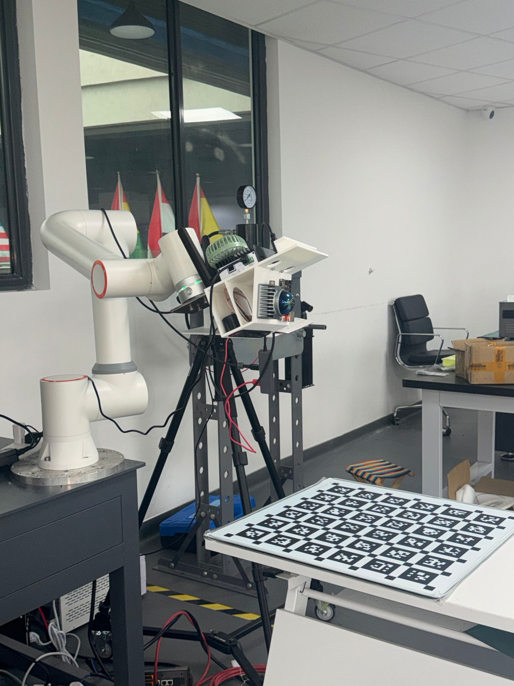
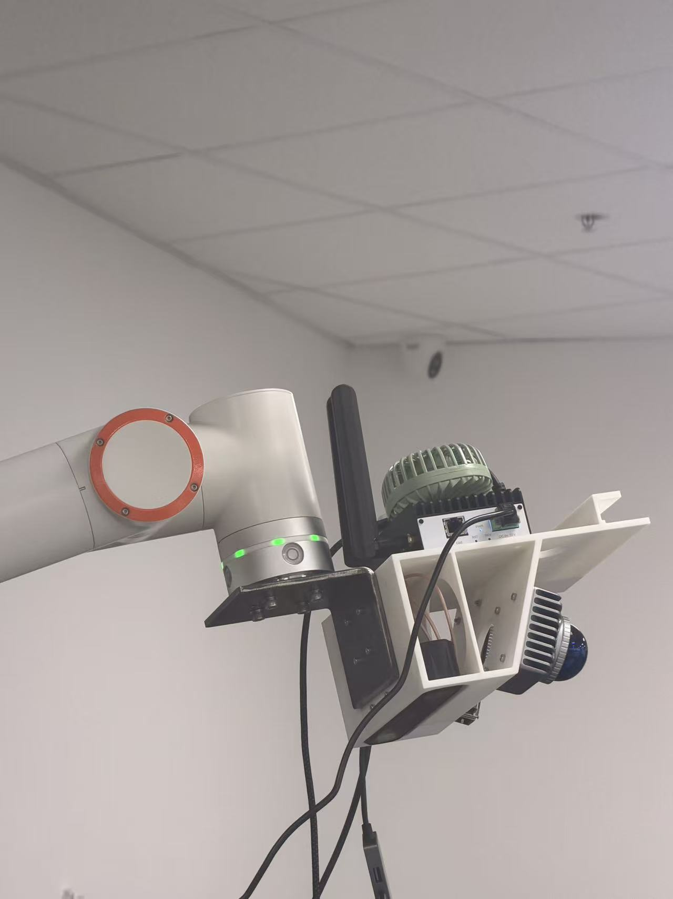

# FR5 + ZED X 眼在手上标定

用 Kalibr Aprilgrid 标定板，求 **ZED X 左目相机相对 FR5 法兰的位姿** `flange_T_left_camera`。

- **输入**：标定板图像、每张图对应的法兰位姿（最好附关节角）、相机内参。
- **输出**：手眼结果，以及说明结果可信程度的质量报告。

图像和位姿由你们自己的系统采集，本仓库只负责标定，不依赖 ZED 或 FAIRINO 的 SDK。维护和修改代码前，先读 [DEVELOPMENT.md](DEVELOPMENT.md)。

## 真机标定结果（2026-10-09）

<table>
<tr>
<td width="50%"></td>
<td width="50%"></td>
</tr>
<tr><td align="center">标定现场</td><td align="center">末端安装：ZED X 与 ZED Box Mini 装在同一个支架上</td></tr>
</table>

数据和结果都在 [`results/s003/`](results/s003)：

| 文件 | 内容 |
|---|---|
| `images/0001.png` … `0025.png` | 25 张校正后左目图像（1920×1080） |
| `images/0001.json` … | 每张图拍摄时，同一个相机实例读出的内参和相机设置 |
| `poses.csv` | 每张图对应的法兰位姿（WebApp 输入的 TCP）和关节角 |
| `camera.yaml`、`target.yaml` | 内参、标定板定义 |
| `result.json` | 标定结果和完整的质量报告 |

在仓库根目录运行下面的命令，就能得到完全相同的结果。这里用 `--output` 另存一份，避免覆盖仓库里的 `result.json`：

```powershell
.venv\Scripts\python.exe -m handeye solve --session results\s003 --output calibration-data\s003_result.json
```

**相机内参**：ZED SDK 给出的校正后左目内参，HD1080（1920×1080），自标定关闭，畸变为 0。相机序列号 49953548，ZED SDK 5.1.2。

```text
K = [[734.4576,    0.0000, 987.4609],
     [  0.0000,  734.4576, 556.6715],
     [  0.0000,    0.0000,   1.0000]]
```

这组内参经过了三方面核对：
- **和图像对应**：25 张图的 JSON 里记录的内参都和它完全一致。
- **和图像本身一致**：只用这 25 张图独立估计内参，主点只差 (+0.2, −1.1) px，焦距只差 +0.25% / +0.28%。固定使用这组 K 时，角点重投影误差为 0.127 px；把内参全部放开估计，也只降到 0.109 px。
- **对手眼结果影响很小**：把独立估计的内参代入手眼求解，结果只变约 1 mm，一致性反而略差。所以直接使用 SDK 给的内参。

内参随分辨率而变：同一台相机在 HD1200 下 fx = 728.96，在 HD1080 下 fx = 734.46，必须按采集时的分辨率导出。

**手眼结果** `flange_T_left_camera`：把左目光学坐标系（x 向右、y 向下、z 沿光轴向前）中的点变换到法兰坐标系，平移单位为米。

```text
[[ 0.999661  0.000784  0.026026 -0.058961]
 [-0.000757  0.999999 -0.001076 -0.071595]
 [-0.026027  0.001056  0.999661  0.099279]
 [ 0.        0.        0.        1.      ]]
```

- **平移**：左目光心在法兰坐标系中位于 (−58.96, −71.60, +99.28) mm。
- **旋转**：相机光轴和法兰 Z 轴几乎平行，绕 Y 轴偏 1.49°；相机 x 轴和法兰 X 轴基本一致。按 FR5 的 `Rz·Ry·Rx` 写法为 RX 0.061°、RY 1.491°、RZ −0.043°。
- 逆矩阵 `left_camera_T_flange` 也保存在 `result.json` 里。

| 指标 | 数值 | 门限 |
|---|---|---|
| 状态 | **accepted**（通过） | — |
| 选用的方法 | Park + 像素优化（4 折交叉验证误差最小） | — |
| 测试视图角点误差 | 1.36 px | ≤ 2 px |
| 最差的单个测试视图 | 2.05 px | ≤ 4 px |
| 固定板的位置 / 角度一致性（测试视图） | 1.25 mm / 0.11° | ≤ 3 mm / 0.5° |
| 随机不确定度（jackknife） | 1.48 mm / 0.12° | 只反映随机误差 |
| 单张图的 PnP 误差 | 0.09–0.15 px | ≤ 2 px |
| 姿态覆盖 | 标定板覆盖图像 74%；相机离板 0.42–0.72 m，倾斜 10–37°；姿态之间最大相对转角 92° | — |
| 相机稳定性 | 同一位姿重拍，角点位移 0.06–0.09 px | — |

**精度判断**：随机误差约 ±1.5 mm / ±0.12°。此外还有系统误差：不同求解方法之间相差约 5.8 mm / 0.4°，板尺度诊断偏离 −0.52%。我们已经逐项排除了内参、相机移动和关节零位这几种原因，剩下最可能的是 FR5 在大范围运动时的绝对定位误差。综合来看，实际精度约为 **1–3 mm、0.1–0.3°**。这次还没有做独立验证（尖端点检查或任务测试）。

完整的采集步骤和注意事项见 [第 6 节](#6-真机复现流程)。

## 快速上手

下面的命令都在 Windows 的 PowerShell 或 cmd 里运行，先进入仓库根目录（Ubuntu 的写法见 [1.4](#14-软件环境)）。

**0. 安装环境**（一次即可，详见 [1.4](#14-软件环境)）

```powershell
py -m venv .venv
```

```powershell
.venv\Scripts\python.exe -m pip install -r requirements.txt
```

**1. 新建 session 文件夹**。从 `templates/session/` 复制出 `camera.yaml`、`target.yaml`、`poses.csv`、`touch_points.csv`，并建好空的 `images/`：

```powershell
.venv\Scripts\python.exe -m handeye init --session calibration-data\sessions\s001
```

**2. 填写配置**（写法见 [2.1](#21-session-文件夹与配置文件)）

| 文件 | 填什么 | 最快的办法 |
|---|---|---|
| `camera.yaml` | 校正后左目内参 | 在 ZED Box（Linux）上运行 `python3 tools/zed_camera_yaml.py --resolution HD1080 --output camera.yaml`（分辨率要和采集时一致），再拷过来覆盖 |
| `target.yaml` | 标定板尺寸 | 使用已确认准确的 6×6、55 mm、间隙 16.5 mm |
| `images/` | 每个机位一张图 | 从 Box 拷过来 |
| `poses.csv` | 每张图一行：法兰位姿 + 6 个关节角 | 照抄 FR5 WebApp 的显示值 |

**3. 核对位姿表**（可选，需要关节角）

```powershell
.venv\Scripts\python.exe -m handeye check-poses --poses calibration-data\sessions\s001\poses.csv
```

**4. 标定**。`--expected-translation-mm` 是事先粗估的"左目光心在法兰坐标系中的位置"（mm），只用来核对结果，估法见 [2.1](#21-session-文件夹与配置文件) 末尾。下面的 `60 -75 45` 只是示例，要换成自己的估计值：

```powershell
.venv\Scripts\python.exe -m handeye solve --session calibration-data\sessions\s001 --expected-translation-mm 60 -75 45
```

屏幕输出和 `result.json` 的读法见 [第 4 节](#4-结果评估与诊断)。

**5. 复核**（推荐）。换一组不同的姿态再建一个 session、再标定一次，比较两次的结果：

```powershell
.venv\Scripts\python.exe -m handeye compare --results calibration-data\sessions\s001\result.json calibration-data\sessions\s002\result.json
```

第一次上真机，请按 [第 5 节](#5-上真机试标清单) 的试标清单逐项核对。

**没有硬件也能先跑一遍**：用仿真生成一个与真实数据格式完全相同的 session，再对它标定：

```powershell
.venv\Scripts\python.exe -B sim\synthetic.py make --output calibration-data\sim_runs\demo --robot-noise-mm 0.2 --robot-noise-deg 0.02
```

```powershell
.venv\Scripts\python.exe -m handeye solve --session calibration-data\sim_runs\demo
```

不需要激活虚拟环境，直接调用 `.venv\Scripts\python.exe` 即可，这样也不会碰到 PowerShell 禁止运行脚本的限制。

## 目录结构

```text
calibration/
├─ README.md
├─ DEVELOPMENT.md            维护与交接说明（约定、设计原因、已知问题）
├─ requirements.txt
├─ handeye/                  标定算法，用 python -m handeye 运行
│  ├─ __main__.py            命令行：init / detect / check-poses / solve / compare / validate
│  ├─ dataset.py             读取 session（camera.yaml、poses.csv、images/）
│  ├─ board.py               Kalibr Aprilgrid 几何与角点检测
│  ├─ observations.py        单张图的 PnP 与锁错 tag 剔除
│  ├─ solver.py              手眼初值、重投影优化、交叉验证选方法、质量门限
│  ├─ diagnostics.py         覆盖度、jackknife 不确定度、内参/畸变/板尺度诊断
│  ├─ kinematics.py          FR5 运动学、欧拉角约定、位姿-关节角一致性、TCP/工件坐标系检查
│  ├─ validation.py          尖端点独立验证、多次结果比较
│  └─ geometry.py            变换、FR5 位姿约定、图像读写
├─ templates/session/        新 session 的模板，init 会复制它
├─ tools/
│  ├─ zed_camera_yaml.py     在 ZED Box 上导出 camera.yaml
│  └─ zed_snapshot.py        在 ZED Box 上拍一张标定图（相机设置与采集程序一致）
├─ results/s003/             2026-10-09 真机标定的图像、位姿和结果
├─ docs/images/              README 用的照片
├─ sim/synthetic.py          仿真数据生成与验证套件
├─ tests/                    单元测试
└─ calibration-data/         本地数据，不进 git
   ├─ sessions/              真实采集的 session
   ├─ sim_runs/              仿真输出
   ├─ reference/             数据手册、标定板照片、硬件审查报告
   └─ archive/               早先基于 SDK 的自动采集代码，仅供参考
```

## 1. 硬件与环境

### 1.1 硬件清单

| 设备 | 型号与要点 |
|---|---|
| 机械臂 | FAIRINO FR5：负载 5 kg，工作半径 922 mm，重复定位精度 ±0.02 mm |
| 相机 | ZED X，2.2 mm 镜头：1920×1200 全局快门，视场 110°×80°，名义 fx ≈ 733 px，基线 120 mm，239 g |
| 计算单元 | ZED Box Mini（Orin NX 16GB）：600 g，12 V（10.5–13.5 V），最大 60 W，Jetson 上已装好 ZED SDK |
| 标定板 | Kalibr Aprilgrid 6×6，tag 边长 55 mm，间隙 16.5 mm，tag 阵列外缘 412.5 mm |
| 电脑 | Windows 笔记本（Ubuntu 也可以），只运行本仓库 |

### 1.2 连接方式

```text
FR5 末端法兰
 └─ 刚性支架 ─┬─ ZED X 2.2 mm
              └─ ZED Box Mini ──HDMI── 显示器（查看、保存图像）
                  GMSL2 短线，与相机一起随末端运动；12 V 电源线沿机械臂走线

Windows 笔记本 ──网线── FR5 控制器：在浏览器里用 WebApp 移动机械臂，读取位姿和关节角
图像从 Box 拷到笔记本的 session\images\ 下
```

每个机位：用 WebApp 把机械臂移到位 → 等它完全停稳 → 在 Box 上保存一张图 → 在 WebApp 上抄下法兰位姿和 6 个关节角。

图像可以用 U 盘拷，也可以用 Windows 自带的 `scp` 从 Box（Linux）复制。下面的用户名、IP 和图像目录都要换成你们 Box 上的实际值：

```powershell
scp -r 用户名@Box的IP:/home/用户名/images calibration-data\sessions\s001\
```

### 1.3 安装与采集要点

下面几项决定精度，其中标 ⚠️ 的算法无法事后发现或纠正。

- ⚠️ **图像不能被翻转**：ZED 以 `FLIP_MODE.OFF` 打开。SDK 默认的 `AUTO` 在相机倒置时会把图像转 180°，标定结果也随之转 180°，任何检查都发现不了。
- ⚠️ **自标定必须关闭**：导出内参的工具、在 Box 上保存图像的采集程序、实际使用的程序，三处都以 `camera_disable_self_calib = True` 打开相机（导出工具默认已关闭，另外两处要你们自己设置）。自标定每次启动都会重新修正左右目之间的外参，校正后的内参会变，校正后左目的坐标轴相对相机外壳也会轻微转动，所以手眼结果只对标定时的那次启动成立。
- **预热**：Box 紧挨相机、会发热，开机后等 20–30 分钟再采集；实际使用时也保持同样的热状态。
- ⚠️ **支架刚性**：相机尽量靠近法兰、直接固定，Box 的 600 g 不要经过相机的安装件传递。支架随姿态变化的变形无法被标定消除。
- **线缆**：电源线在支架上固定好，给 J4–J6 留足旋转余量，不能拉扯末端。
- **负载**：末端总重约 1.1–1.3 kg，远低于 5 kg，但要在控制器里设置负载质量和质心。
- **标定板**：按已确认准确的理论尺寸使用，牢固固定并保持平整（见 [2.1](#21-session-文件夹与配置文件)）。

### 1.4 软件环境

**电脑（Windows 10/11）**：从 [python.org](https://www.python.org/downloads/windows/) 安装 Python 3.10 或更新版本，安装时保持默认勾选的 `py` 启动器。不需要 ZED 或 FAIRINO 的 SDK。在仓库根目录打开 PowerShell 或 cmd，依次运行：

```powershell
py -m venv .venv
```

```powershell
.venv\Scripts\python.exe -m pip install -r requirements.txt
```

```powershell
.venv\Scripts\python.exe -B -m unittest discover -s tests
```

最后一条运行全部 67 个单元测试，约 1–1.5 分钟，应显示 `OK`。之后所有命令都用 `.venv\Scripts\python.exe`，不需要激活虚拟环境。

依赖为 numpy、OpenCV contrib 4.x、SciPy、PyYAML。OpenCV 限定 4.x，因为 [5.0.0.93 的 Python 包缺失 `calibrateHandEye`](https://github.com/opencv/opencv/issues/29565)。仓库放在中文路径下也能正常读写图像。

测试过的依赖组合（都在 Windows 上，67 个单元测试在两种环境中都全部通过）：

| Python | opencv-contrib-python | numpy | scipy | PyYAML |
|---|---|---|---|---|
| 3.10.21 | 4.14.0 | 2.2.6 | 1.15.3 | 6.0.3 |
| 3.14.7 | 4.14.0 | 2.5.3 | 1.18.1 | 6.0.3 |

**也可以用 Ubuntu**（22.04 自带的 Python 3.10 即可，但还没在 Ubuntu 上跑过测试）：先 `sudo apt install python3-venv`，再用 `python3 -m venv .venv` 建环境；本文所有命令里的 `.venv\Scripts\python.exe` 换成 `.venv/bin/python`，路径里的 `\` 换成 `/`。

**ZED Box**：需要 ZED SDK、`pyzed` 和 PyYAML（`python3 -m pip install PyYAML`）。只需把 `tools/zed_camera_yaml.py`（导出内参）和 `tools/zed_snapshot.py`（拍标定图）两个文件拷过去，不需要整个仓库。两个工具都已在 ZED Box 上验证过（L4T R36.4.4、ZED SDK 5.1.2、Python 3.10、PyYAML 5.4.1），用法见 [第 6 节](#6-真机复现流程)。导出内参时的配置必须和保存图像的程序一致；也不要拿 Explorer 显示的 raw 内参来比对。

## 2. 标定算法

### 2.1 Session 文件夹与配置文件

```text
calibration-data/sessions/s001/
├─ camera.yaml       校正后左目内参
├─ target.yaml       标定板定义
├─ poses.csv         每张图一行的位姿表
├─ images/           图像（PNG 等无损格式）
└─ touch_points.csv  可选，独立验证用
```

**camera.yaml**：ZED **校正后左目**（`VIEW.LEFT`）的内参，分辨率必须与图像一致。

```yaml
image_width: 1920
image_height: 1200
fx: 733.0          # 以下四个值换成实际读出的值
fy: 733.0
cx: 959.5
cy: 599.5
distortion: [0.0, 0.0, 0.0, 0.0, 0.0]   # 校正图为 0
```

数值来自 SDK 的 `calibration_parameters.left_cam`。`tools/zed_camera_yaml.py --output camera.yaml` 直接写入文件，避免 SDK 的终端日志混入 YAML，同时记录实际分辨率、帧率、序列号和 SDK 版本。**不要用 `SN*.conf` 或 Explorer 的 raw 内参代替**，它们对应未校正图像。

导出工具会单独打开一次相机，关闭自标定，并核对 SDK 确实按此设置打开。只有采集程序和实际使用的程序也关闭自标定（见 [1.3](#13-安装与采集要点)），并且使用同一台相机、同一 SDK 版本、同一分辨率和 `FLIP_MODE.OFF`，每次启动的校正参数才相同，单独导出的内参才对应已保存的图像。`camera.yaml` 里的元数据只是记录，不能代替去核对采集程序的实际设置。

`compare` 和 `validate --session` 要求两个 session 的内参完全相同，内参稍有差别就报错，而不是放宽比较：内参不同说明两次启动的校正参数不同，手眼结果本身也可能变了。自标定全程关闭时，这个条件自然满足。

显式 `image_flip: ON/AUTO`、非 `LEFT` 或未校正图像声明会被拒绝。旧文件缺少这些字段仍可读取，缺失不代表相机设置已核验。

**target.yaml**：按你确认的准确理论值固定为 6×6、`tagSize: 0.055`、`tagSpacing: 0.3`（间隙与边长之比，不是米），间隙 16.5 mm，tag 阵列外缘 **412.5 mm**。主求解不估计或修改板尺寸；尺度诊断只检查图像、内参与机械臂数据是否和这组准确尺寸一致。

**poses.csv**：以 `#` 开头的行是注释。

```text
image,x_mm,y_mm,z_mm,rx_deg,ry_deg,rz_deg,j1_deg,j2_deg,j3_deg,j4_deg,j5_deg,j6_deg
images/0001.png,512.340,-35.120,610.450,-176.320,8.140,31.500,-12.300,-85.400,92.100,-96.800,-88.500,40.200
```

- `x_mm … rz_deg` 是**法兰**（工具坐标系 0）在**基坐标系**（工件/用户坐标系 0）下的位姿，照抄 WebApp 的显示值。读数前确认 WebApp 当前激活的工具和工件坐标系都是 0。
- `j1_deg … j6_deg` 是同一时刻的关节角。它们是可选的，但强烈建议填写，因为可以用来找出抄错的行、核对欧拉角约定。要么六列都填，要么连同表头一起删掉。
- 报错信息会指明是哪一行出了问题。

**touch_points.csv**：可选，见 [4.5](#45-重复性与独立验证)。

**支架估计**（`solve --expected-translation-mm X Y Z`）：手眼结果 `flange_T_left_camera` 的平移，就是**左目光心在法兰坐标系中的坐标**。事先用支架 CAD 或尺子粗估这三个数；算出的平移与估计值相差超过 `--expected-tolerance-mm`（默认 10 mm）时，结果判为 `rejected`。它不参与求解，只用来发现整体性错误（例如位姿读成了 TCP、坐标轴或符号弄错）；不给出时只发警告。

- **法兰坐标系**：原点在法兰端面中心，+Z 通常垂直于端面朝外。三个轴的方向在 WebApp 里确认：选工具坐标系 0，用"工具坐标"模式分别点动 +X、+Y、+Z，看法兰往哪边走。
- **左目光心**：从相机背后、顺着镜头朝向看，是左边那个镜头的中心，离外壳横向中心 60 mm（基线 120 mm）；深度取镜头前表面往里几毫米即可。
- **三个数**：从法兰中心出发，沿法兰的 X、Y、Z 轴分别量到左目光心的距离，带正负号。只看光心位置，与相机朝向无关。误差在 ±5 mm 内就够用；估得更粗时，可以把 `--expected-tolerance-mm` 调大。
- **例子**：左目光心在法兰 +X 方向 60 mm、−Y 方向 75 mm，并且在法兰端面外侧 45 mm，就填 `--expected-translation-mm 60 -75 45`。
- **只因这一项被拒绝时**：把屏幕上打印的 `flange_T_left_camera translation [...]` 与估计值逐轴对比。如果只有某一轴的正负号相反，多半是估计时把轴的方向弄反了。

### 2.2 采集姿态建议

- 20–30 个姿态；相机到板的距离 0.35–0.7 m（2.2 mm 是广角镜头，1.0 m 时每个码元只剩约 4 px）。
- 绕至少两个不同的轴旋转，幅度 20–40°，包括绕相机光轴的滚转；板相对视线倾斜 20–40°。
- 让标定板出现在图像的各个区域，包括边缘和角落。
- 避开奇异位形：J5 接近 0° 或 180°、J3 接近 0°、腕部中心接近 J1 轴线。
- 每个姿态都要等机械臂完全停稳再拍照和读数；不要在拖动模式下读数。

### 2.3 数学模型与处理流程

每张图 i 满足：

```text
base_T_flange_i · X · camera_T_board_i = Y
X = flange_T_left_camera（要求的手眼结果）   Y = base_T_board（标定板在基坐标系中的位姿）
```

1. **检测角点**：用 OpenCV 检测 AprilTag 36h11（2 码元黑边）。Kalibr 板间隙处的小方块与每个 tag 角相接，角点是 X 形交点，OpenCV 在这里偏 1–2 px，所以再按间隙大小做一次 `cornerSubPix`（合成图平均误差 0.03 px）。
2. **单帧 PnP**：得到 `camera_T_board`，按整板残差丢弃锁错特征的 tag。剩下的完整 tag 必须至少 4 个，并跨越两行两列。
3. **候选解**：
   - Park、Daniilidis：相对运动形式 AX = XB 的闭式解；
   - 以 Park 为初值，对 X 和 Y 联合最小化全部角点的重投影误差（Huber 损失，机械臂位姿视为准确）。
4. **选方法**：每 5 个可用视图取 1 个作为**测试视图**，只用于报告和判定；在其余训练视图上做 4 折交叉验证，选交叉验证误差最小的方法，再用全部训练视图拟合。候选资格只看训练集和 CV；选定方法的测试结果无效时直接拒绝，不按测试成绩换方法。
5. **质量门限与诊断**：见 [第 4 节](#4-结果评估与诊断)。

### 2.4 命令一览

| 命令 | 作用 |
|---|---|
| `init --session DIR [--camera FILE] [--intrinsics FX FY CX CY] [--size W H] [--target FILE]` | 按模板新建 session；可直接写入内参 |
| `detect --image IMG [--overlay OUT]` | 检查一张图的 tag 编号和角点方向（每个 tag 的蓝色 `0` 应在该 tag 的物理右下角） |
| `check-poses --poses CSV` | 用 FR5 运动学核对位姿表：欧拉角约定是否为 `Rz·Ry·Rx`、有没有与关节角不一致的行、读数时是否激活了 TCP 或工件坐标系 |
| `solve --session DIR [选项]` | 标定，写出 `result.json` |
| `compare --results A.json B.json [...]` | 比较同一安装状态下多次独立标定的结果 |
| `validate --result JSON --points CSV` | 板位姿检查：用尖端点核对结果里的板位姿 Y；**不能**证明手眼结果 X 正确 |
| `validate --result JSON --points CSV --session NEW_DIR` | 独立手眼检查：用一个未参与标定的新 session 和尖端点检验 X（见 [4.5](#45-重复性与独立验证)） |

`solve` 的常用选项：
- 核对与判定：`--expected-translation-mm X Y Z`、`--expected-tolerance-mm`（默认 10），以及 [4.3](#43-质量门限) 里的各项门限。
- 检测与求解：`--target`、`--min-tags`（4）、`--max-pnp-rmse`（2 px）、`--no-refine`。
- 诊断：`--bootstrap`（jackknife 子集数，默认 30，0 为关闭）、`--max-scale-error`（0.003）、`--max-focal-error`（0.003）、`--max-principal-point-px`（3）、`--max-distortion-px`（1）。
- `--allow-tcp-offset`：确实要标定相机相对某个 TCP 的位姿时使用，这时位姿读成 TCP 只警告、不拒绝。结果只输出 `pose_moving_T_left_camera`，没有 `flange_T_left_camera`，也不能用于 `compare`、`validate` 和支架 CAD 核对（见 [4.4](#44-诊断与处理)）。标定相对法兰的位姿时不需要它。

运行 `.venv\Scripts\python.exe -m handeye solve --help` 查看全部选项。

## 3. 仿真验证

`sim/synthetic.py` 按实际参数渲染 Kalibr 板图像：板 412.5 mm，ZED X 2.2 mm（fx=733），1920×1200。姿态必须有 FR5 名义逆解、在 URDF 关节限位内，并远离奇异位形。输出格式与真实 session 完全相同，另附真值 `truth.json` 和尖端点 `touch_points.csv`。

```powershell
.venv\Scripts\python.exe -B -m unittest discover -s tests -v
```

```powershell
.venv\Scripts\python.exe -B sim\synthetic.py suite
```

```powershell
.venv\Scripts\python.exe -B sim\synthetic.py compare --session calibration-data\sim_runs\demo
```

- `make` 的注入选项：`--robot-noise-mm/--robot-noise-deg`、`--board-scale`、`--k-error`、`--residual-k1`、`--flip180`、`--euler-order xyz`、`--tcp-offset-mm`、`--user-frame`、`--pose-outliers`、`--pose-typo`、`--joint-offset-deg`、`--jpeg-quality`、`--single-axis`。
- `suite` 的"检查"场景事先写明预期，有一项不符就返回退出码 1；"量化"场景只报告数值。输出放在 `calibration-data/sim_runs/`，图像用完即删。

2026-09-24 的结果（seed 0，25 个姿态）。"正确"指误差 ≤ 2 mm 且 ≤ 0.2°。警告标记：S 板尺度、K 内参、D 残余畸变、R 位姿行、T 位姿读成 TCP、U 位姿在工件坐标系下。

| 场景 | 类型 | 判定 | 与真值的误差 | jackknife sd | 正确 | 警告 |
|---|---|---|---|---|---|---|
| clean | 检查 | accepted | 0.003 mm / 0.000° | 0.004 mm | 是 | — |
| 位姿噪声 0.2 mm / 0.02° | 检查 | accepted | 0.11 mm / 0.022° | 0.16 mm | 是 | — |
| 3 个位姿偏 3 mm / 0.5° | 检查 | accepted | 0.11 mm / 0.043° | 0.75 mm | 是 | R |
| 一行 x 多抄 10 mm | 检查 | accepted | 0.55 mm / 0.090° | 0.85 mm | 是 | R（指出第 4 行） |
| 板大 1% | 检查 | accepted | 4.6 mm / 0.040° | 0.53 mm | 否 | S |
| 内参：焦距 +0.5%，主点 3 px | 检查 | accepted | 2.3 mm / 0.28° | 0.24 mm | 否 | K |
| 残余畸变 k1 = −0.0008（角落约 2 px） | 检查 | accepted | 0.07 mm / 0.001° | 0.007 mm | 是 | D |
| 位姿读成 120 mm 的 TCP | 检查 | **rejected** | 120 mm | 0.004 mm | 否 | T |
| 位姿读在工件坐标系下 | 检查 | accepted | 0.004 mm / 0.001° | 0.005 mm | 是 | U |
| 图像转 180° | 检查 | accepted | 180° | 0.004 mm | **否** | **无** |
| 欧拉角约定错误 | 检查 | rejected | 702 mm / 179° | — | 否 | S T U |
| 只绕一个轴旋转 | 检查 | insufficient_data | — | — | — | — |
| 位姿噪声 0.5 mm / 0.05° | 量化 | accepted | 0.28 mm / 0.053° | 0.40 mm | 是 | — |
| 关节零位系统误差 0.02° | 量化 | accepted | 0.12 mm / 0.061° | 0.14 mm | 是 | — |
| JPEG q70（有损视频的替代） | 量化 | accepted | 0.004 mm / 0.000° | 0.005 mm | 是 | — |
| 测试视图中 2 个位姿有误 | 检查 | rejected | 0.003 mm / 0.000° | 0.005 mm | 是 | R |
| 噪声 + 板 1% + 内参误差 | 量化 | accepted | 2.4 mm / 0.30° | 0.79 mm | 否 | S K |

从这张表可以看出：
- 检查场景 13/13 符合预期（含测试视图异常拒绝检查）。
- 结果有错时，除了"图像转 180°"，其余都会被拒绝或给出警告；正常数据（包括带位姿噪声的）不产生诊断警告。
- jackknife sd 与真实误差在同一量级，但它**反映不了**板尺寸、内参这类所有视图共有的误差。

仿真的局限：渲染与检测共用同一板定义；内参为名义值；FR5 只用名义运动学，未检查碰撞；有损视频只用 JPEG 近似。因此仿真只验证所覆盖场景的实现和检查逻辑，**不能证明整体正确性或真机精度**。

## 4. 结果评估与诊断

### 4.1 看懂输出

下面是仿真数据（位姿噪声 0.2 mm / 0.02°，20 个姿态，给出了支架 CAD 平移）的实际输出：

```text
Views: 20 in poses.csv, 20 usable, 0 rejected; train 16, test 4          ← 可用 / 被拒绝的视图数
  Park                   CV 0.753 px | test 0.566 px, board 0.45 mm / 0.041 deg
  Daniilidis             CV 0.758 px | test 0.559 px, board 0.44 mm / 0.040 deg
  Park+pixel_refinement  CV 0.851 px | test 0.631 px, board 0.63 mm / 0.079 deg
Chosen Park: flange_T_left_camera translation [-60.00, 75.05, 44.93] mm      ← 按 CV 选出
  jackknife sd: translation 0.181 mm [0.0995, 0.0445, 0.1451], rotation 0.0199 deg (random errors only)
  board scale (robot-metric fit): 0.9996x target.yaml
  intrinsics from the images vs camera.yaml: focal +0.00% / +0.00%, principal point (-0.0, +0.0) px,
    residual distortion 0.07 px at the image corner
STATUS: ACCEPTED
WARNING: the board covered only 40% of the image over all views; move it towards the image edges and corners too
```

- **CV**：交叉验证的角点误差，用来选方法。
- **test**：测试视图上的角点误差，以及把每个视图算出的板位姿放在一起时的离散程度（板是固定的，理想情况为 0）。
- **jackknife sd**：结果的随机不确定度。
- **board scale**：相对于固定准确板尺寸的模型一致性诊断，接近 1 为正常；未收敛时只显示状态和警告。
- **intrinsics from the images**：只用图像重新估计的内参和残余畸变与 `camera.yaml` 的差，接近 0 为正常。

### 4.2 状态与退出码

| 状态 | 含义 | 退出码 |
|---|---|---|
| `accepted` | 通过全部质量门限 | 0 |
| `rejected` | 某项门限超限，或位姿读成了 TCP；原因写在 `reasons` 里 | 2 |
| `insufficient_data` | 可用视图少于 12 个，或旋转缺少两个不同的轴 | 2 |

程序出错时退出码为 1。三种状态都会写出 `result.json`。`accepted` 只表示内部一致性检查通过，**不是实测精度**。

### 4.3 质量门限

门限是本项目的默认值，应按任务要求和到货实测调整，不是厂家指标。

| 检查项 | 选项 | 默认 |
|---|---|---|
| 测试视图角点 RMSE | `--max-test-px` | 2.0 px |
| 最差单个测试视图的 RMSE | `--max-view-px` | 4.0 px |
| 固定板位置一致性（测试视图） | `--max-board-mm` | 3.0 mm |
| 固定板角度一致性（测试视图） | `--max-board-deg` | 0.5° |
| 与支架 CAD 的平移偏差 | `--expected-translation-mm`、`--expected-tolerance-mm` | 容差 10 mm；不给出时只警告 |
| 位姿读成 TCP（需要关节角） | `--allow-tcp-offset` 明确允许 TCP 输出 | 法兰偏移 > 5 mm 或 > 0.5° 即拒绝 |

### 4.4 诊断与处理

下表中的诊断只给出警告，不会改变标定结果。

| 警告 | 含义 | 处理 |
|---|---|---|
| `board scale consistency fit is …x target.yaml` | 准确板尺寸与当前模型的尺度一致性偏差超过 0.3% | 检查内参、机械臂位姿、图像与位姿配对；保持准确板尺寸不变。诊断不收敛时显示 inconclusive/failed，不报告可信尺度 |
| `focal length from the images …` 或 `principal point from the images …` | 仅用图像估计的焦距偏离超过 0.3%，或主点偏离超过 3 px（且超过 3 倍标准差） | 核对 `camera.yaml` 是否为校正后左目、分辨率是否一致 |
| `residual radial distortion in the images …` | 图像里还有畸变，角落偏移超过 1 px | 确认存的是校正后的左目图，而不是原始图 |
| `poses.csv row N: pose disagrees with its joints` | 这一行的位姿与关节角对不上 | 检查抄写，以及位姿和关节角是否在同一时刻读取 |
| `poses look like they are in a user/work frame` | 读数时激活了工件坐标系 | 手眼结果仍相对法兰；板位姿改为 `pose_reference_T_board`，不再导出 `base_T_board`，不能直接与基坐标系触点比较 |
| `poses.csv has no joint angles` | 没有关节角，无法做以上两项检查 | 补上关节角，或至少给出 `--expected-translation-mm` |
| `… differs from … by … mm` | 不同方法的结果相差较大 | 增加姿态、加大旋转幅度，检查位姿数据 |
| `board covered only …%`、`board tilt only …`、`largest robot rotation …` | 姿态覆盖不足 | 按 [2.2](#22-采集姿态建议) 补拍 |
| 某个视图出现在 `rejected_views` 里 | 该图检测失败或 PnP 误差大 | 看给出的原因：tag 太少、太远、模糊或过曝 |

如果拒绝原因是 `poses look like an active TCP`，说明读数时 WebApp 激活了工具坐标系，结果会是相机相对那个 TCP 的位姿，而不是相对法兰（仿真中差了整整 120 mm）。处理办法：把工具坐标系设为 0 后重新读取位姿。若明确使用 `--allow-tcp-offset`，输出 `pose_moving_T_left_camera` 和 `frames.pose_moving=reported_tcp`，不提供法兰别名，也不能直接做法兰 CAD 核对、重复性比较或基坐标系验收。名义运动学拟合的偏移不作为真实坐标转换。

这些诊断的原理：

- **内参与残余畸变只看图像**：每张图的板位姿各自自由，只用图像重新估计 fx、fy、cx、cy 和径向畸变 k1（相当于一次普通的相机标定），再与 `camera.yaml` 比较。因为完全不用机械臂位姿，所以机械臂误差漏不进来。最初的做法是和机械臂数据联合拟合，结果 0.5 mm 的位姿噪声被当成了 2.7 px 的畸变，因此改成了现在的方式。这项检查看不出板尺寸，并且假设标定板是平的。
- **尺度一致性检查要结合机械臂**：单独放开尺度进行诊断拟合，结果不反馈给主求解。已知板尺寸准确时，偏离 1 说明当前内参、位姿或数据配对等模型存在不一致；仅靠这个值不能确定原因。仿真中的板尺度误差是故障注入，不改变实体板的准确尺寸假设。
- **位姿坐标系**：把 FK(关节角) 与记录的位姿对齐，所需的常量偏移在法兰端就是 TCP，在基座端就是工件坐标系。FR5 的 DH 法兰就是控制器的法兰，所以正常情况下这两个偏移都接近 0。
- **jackknife 不确定度**：对训练视图反复抽取 80% 的子集重新求解，由结果的离散程度估计误差，其中包含机械臂位姿噪声的影响。雅可比协方差只计入像素噪声，仿真中低估约 10 倍，所以不用它。

### 4.5 重复性与独立验证

**重复性**（不需要额外工具，推荐每次都做）：安装不动，换一组不同的姿态再建一个 session、再标定一次，然后比较：

```powershell
.venv\Scripts\python.exe -m handeye compare --results calibration-data\sessions\s001\result.json calibration-data\sessions\s002\result.json
```

仿真示例：两组各 20 个姿态，结果相差 0.148 mm，是 jackknife 随机误差尺度（0.225 mm）的 0.7 倍，判定为一致。
- 差异超过 2 mm / 0.2°，或超过随机误差尺度的 3 倍时，判为 `DIFFERENT`，退出码 2。这说明两次之间有东西变了：支架松动、热状态不同、位姿坐标系不同等。
- 一致也**不能**排除两次共有的误差，比如板尺寸、内参、图像翻转。

**板位姿检查**（需要尖端工具）：用已知 TCP 的尖端工具，测量板角点在机械臂基坐标系中的位置，填写 `touch_points.csv`。至少 3 个不同且不共线的角点，推荐 0 BL、5 BR、30 TL、35 TR 加内部角。程序拒绝重复、非有限和近共线数据；第二方向的 RMS 展布需至少 10 mm，这是项目默认值。

```powershell
.venv\Scripts\python.exe -B -m handeye validate --result calibration-data\sessions\s001\result.json --points calibration-data\sessions\s001\touch_points.csv
```

输出 `scope=board_pose_check`。它比较保存的 **Y（板位姿）** 与实测触点，报告每点误差、RMS、板位姿差和触点拟合残差。**单凭这项通过，不能认定 X（手眼变换）正确。**

**独立手眼链检查**：保持支架和板的位置不变，另外采集一个未用于拟合的 session（例如 `validation01`），使用同一相机配置及准确板定义，仍记录工具 0、工件坐标系 0 的法兰位姿。至少 3 个可用视图，旋转需覆盖两个不同的轴；建议多采几个分散姿态。运行：

```powershell
.venv\Scripts\python.exe -B -m handeye validate --result calibration-data\sessions\s001\result.json --points calibration-data\sessions\s001\touch_points.csv --session calibration-data\sessions\validation01 --output calibration-data\sessions\validation01\validation.json
```

输出 `scope=handeye_chain_check`。每个新视图使用 `base_T_flange · 已有X · camera_T_board` 预测板角点，再与触点比较；不使用保存的 Y，也不重新拟合 X。总 RMS 或最差视图 RMS 超过 `--max-rms-mm`（默认 3 mm）时退出码为 2。

- `validate` 和 `compare` 只接受当前格式且 `accepted` 的结果。旧结果缺少 `frames` 时，重新运行 `solve`。
- `compare` 至少需要两个不同文件、不同来源 session；不能把同一份结果换名字当作重复标定。原图存在时会检查是否复用像素；原图缺失时明确提示独立性仅依赖记录的路径。
- 独立链检查要求原标定图像仍可读取，并比较解码图像哈希以排除原图复制；不要删除原 session 的图像。路径迁移后需更新数据位置并重新 `solve`。
- 尖端 TCP 自身误差、机械臂误差会进入结果；共享的图像翻转、内参或坐标系声明错误仍可能相互抵消。通过这些检查不能代替最终任务测试。

### 4.6 精度预期

当前合成模型与固定随机种子下，输入准确时误差约为 0.003 mm。这验证了这些场景中的数值实现，不能证明算法普遍无偏。实际精度取决于输入：

| 输入误差（仿真，25 个姿态） | 对结果的影响 | 能否发现 |
|---|---|---|
| 角点检测噪声 | < 0.01 mm | — |
| 位姿噪声 0.2 mm / 0.02° | 0.11 mm / 0.02° | jackknife sd 能反映量级 |
| 板尺寸 +1% | 4.6 mm | 能：板尺度诊断 |
| 内参：焦距 +0.5%，主点 3 px | 2.3 mm / 0.28° | 能：只用图像的内参检查 |
| 残余畸变（角落约 2 px） | 0.07 mm | 能：只用图像的畸变检查 |
| 位姿抄错 10 mm | 0.55 mm | 能：指出具体行 |
| 位姿读成 TCP | 等于 TCP 偏移（120 mm） | 能：被拒绝（需要关节角或 CAD 核对） |
| 欧拉角约定错误 | 数百毫米 | 能：被拒绝 |
| 图像转 180° | 180° | **不能**，只能靠 `FLIP_MODE.OFF` 预防 |

实际精度还取决于 FR5 位姿的**绝对精度**、内参、图像质量、安装刚性和数据配对。重复定位精度不能代替绝对精度，目前没有真机数据可支持亚毫米等精度承诺。**应使用独立 session 的 `validate --session` 和任务层面的测试确定可用精度。**

### 4.7 `result.json` 主要字段

| 字段 | 内容 |
|---|---|
| `status`、`reasons`、`warnings` | 判定、拒绝原因、警告 |
| `schema_version`、`frames` | 结果格式版本 2，以及位姿的移动端、参考端和相机坐标系声明；无关节角时无法交叉核对声明 |
| `chosen.pose_moving_T_left_camera`、`chosen.pose_reference_T_board` | 始终存在的变换；含义以 `frames` 为准 |
| `chosen.flange_T_left_camera` | 仅移动端为 flange 时输出。手眼结果：4×4 矩阵，把左目光学坐标（x 右、y 下、z 沿光轴向前）变换到法兰坐标，平移单位米 |
| `chosen.left_camera_T_flange` | 上面的逆矩阵 |
| `chosen.base_T_board` | 仅参考系为 base 时输出；检测到工件坐标系时不提供此别名 |
| `uncertainty` | jackknife 的平移标准差（mm）和旋转标准差（°） |
| `intrinsics_check` | 仅用图像估计的 fx、fy、cx、cy、k1 及其与 `camera.yaml` 的差和标准差 |
| `board_scale_check` | 固定准确板尺寸下的模型一致性诊断，含收敛 status；失败时不输出尺度估计 |
| `pose_joint_consistency` | 逐行位姿与关节角的一致性、可疑行，以及拟合出的 TCP / 工件坐标系偏移 |
| `data_coverage` | 图像覆盖率、距离、倾角、最大转角 |
| `test_views`、`candidates`、`selection` | 每个测试视图的误差，各方法的交叉验证 / 训练 / 测试误差，选择规则 |
| `accepted_views`、`rejected_views` | 每张图的 tag、被丢弃的 tag、PnP 误差或被拒原因 |

## 5. 上真机试标清单

第一次在真机上标定时，按顺序逐项确认。每一项都针对一个仿真无法覆盖的环节。

1. **环境**：在笔记本上跑一遍单元测试（[1.4](#14-软件环境)），67 个全部通过。
2. **硬件**：支架刚性、线缆固定、控制器里设好负载；Box 开机预热 20–30 分钟。
3. **标定板**：保持已确认的准确理论尺寸；板平整、固定在工作台上。
4. **相机**：确认采集程序以 `camera_disable_self_calib = True`、`FLIP_MODE.OFF` 打开相机（见 [1.3](#13-安装与采集要点)）。在 Box 上运行 `tools/zed_camera_yaml.py --output camera.yaml`，与采集程序的校正后左目内参和配置核对（见 2.1）；不要直接比对 Explorer 的 raw 内参。确认存下的图像是**校正后的单张左目图**：不是左右拼接图，不是原始未校正图，PNG 格式，分辨率和 `camera.yaml` 一致（本次为 1920×1080），`FLIP_MODE.OFF`。
5. **单张图**：`detect --overlay`，应检出 36 个 tag，蓝色 `0` 在 tag 的物理右下角。
6. **位姿**：确认 WebApp 当前的工具坐标系和工件坐标系都是 0；记录 8 个以上分散的姿态（附关节角），运行 `check-poses`，应判 `pass`，拟合出的偏移应接近 0。
7. **标定**：采集 20–30 个姿态，带上支架 CAD 平移运行 `solve`。PnP 误差预计在 0.5 px 以下，然后逐条看警告。
8. **重复性**：换一组姿态再标一次，用 `compare` 比较，应判 `CONSISTENT`。
9. **独立验证**（有尖端工具时）：另采未用于拟合的 session，运行 `validate --session`；不加 `--session` 仅检查板位姿。
10. **调整门限**：根据前几次的实际数值，调整质量门限和诊断阈值。

## 6. 真机复现流程

下面是 2026-10-09 得到上面那组结果的完整步骤。换了场地、标定板位置或末端安装时，按同样的顺序做。命令里的 `<Box IP>` 换成你们 Box 的地址，用户名以 `user` 为例。

### 6.1 现场布置

- **机械臂**：FR5 固定在工作台上。
- **标定板**：平放在旁边的白色桌面上，板中心约在基坐标 (131, −794, −60) mm 处，离基座轴线约 0.8 m。放得偏远，机械臂只能从靠近自己的那半边去拍；不过拍摄角度已经够用。如果可以挪，放在 0.45–0.6 m 处更好。
- **末端**：法兰上装黑色 L 形金属件，白色 3D 打印支架上同时装 ZED X 和 ZED Box Mini，见上方照片。相机光轴大致沿法兰 Z 轴。
- **网络**：笔记本和 Box 在同一个局域网里，笔记本通过 SSH 控制 Box 拍照；FR5 的 WebApp 在浏览器里操作。
- **照明**：10 ms 曝光下，图像平均亮度约 50–60/255，检测正常。更暗时建议补光。

### 6.2 一次性准备

1. **配置 SSH 免密登录**。在笔记本的 PowerShell 里生成密钥：
   ```powershell
   ssh-keygen -t ed25519
   ```
   再把公钥放到 Box 上。这一步要输入一次 Box 的登录密码：
   ```powershell
   type $env:USERPROFILE\.ssh\id_ed25519.pub | ssh user@<Box IP> "mkdir -p ~/.ssh && cat >> ~/.ssh/authorized_keys && chmod 700 ~/.ssh && chmod 600 ~/.ssh/authorized_keys"
   ```
   第一次连接时会问是否信任这台主机。先在 Box 上运行 `ssh-keygen -lf /etc/ssh/ssh_host_ed25519_key.pub`，核对显示的指纹一致后再输入 `yes`。
2. **把两个工具拷到 Box**：
   ```powershell
   scp tools\zed_camera_yaml.py tools\zed_snapshot.py user@<Box IP>:~/
   ```
3. **导出内参**。分辨率必须和采集时一致，本次是 HD1080：
   ```powershell
   ssh user@<Box IP> "python3 ~/zed_camera_yaml.py --resolution HD1080 --fps 15 --output ~/camera.yaml"
   ```
   ```powershell
   scp user@<Box IP>:~/camera.yaml calibration-data\camera.yaml
   ```
4. **新建 session**：
   ```powershell
   .venv\Scripts\python.exe -m handeye init --session calibration-data\sessions\s003 --camera calibration-data\camera.yaml
   ```
5. **统一相机设置**。`zed_snapshot.py` 的默认设置和实际使用的采集程序完全一致：HD1080、15 fps、`FLIP_MODE.OFF`、关闭自标定、手动曝光 10 ms、模拟增益 1000 mdB、数字增益 1。实际运行的程序（本项目是 Box 上的 `zed_record`）也必须设置 `camera_image_flip = FLIP_MODE::OFF` 和 `camera_disable_self_calib = true`，并使用同样的分辨率，否则手眼结果不能直接用于它采集的数据。

### 6.3 每个位姿的操作

| 步骤 | 在哪里 | 做什么 |
|---|---|---|
| 1 | WebApp | 打开"点位移动"，在"工具坐标位置"里输入下表的 X Y Z RX RY RZ，点"**计算**"，核对下方"关节位置"和表中的关节角一致（相差在 0.1° 以内）。差得多说明控制器选了另一组逆解，不要移动。然后在 3D 视图里确认，用低速点"移动"，等机械臂完全停稳 |
| 2 | 笔记本 | 拍一张：`ssh user@<Box IP> "python3 ~/zed_snapshot.py --output ~/calib/s003/images/0001.png"` |
| 3 | 笔记本 | 拷回图像和 JSON：`scp "user@<Box IP>:~/calib/s003/images/0001.*" calibration-data\sessions\s003\images\` |
| 4 | 笔记本 | 检查：`.venv\Scripts\python.exe -m handeye detect --image calibration-data\sessions\s003\images\0001.png`，应检出至少 34 个 tag；JSON 里的 fx、fy、cx、cy 应和 `camera.yaml` 一致 |
| 5 | 笔记本 | 在 `poses.csv` 里追加一行：图像名、输入的 TCP、WebApp 上显示的 J1–J6 |

`zed_snapshot.py` 会自己打开相机，所以拍照前要关掉 ZED Explorer 和 `zed_record`。每拍一张约 8 秒，前 20 帧会丢掉，等手动曝光稳定。

### 6.4 位姿表

- **1–7 号**：法兰位置不变，绕法兰的三个轴各转 ±10°。这是第一轮，用来粗略估计手眼关系和标定板的位置。
- **8–25 号**：根据粗估结果规划。相机离板 0.42–0.72 m，倾斜 10–37°，绕光轴最多转 ±45°，让标定板出现在画面的各个区域。
- **腕部关节范围**：都限制在对这套末端装置安全的范围内：J4 −154°～−77°，J5 −119°～−56°，J6 −32°～74°。超出这个范围时，Box 可能碰到机械臂腕部。

这些位姿只适用于本次的标定板位置和末端安装。板的位置变了，就要重新规划。

<details>
<summary>25 个位姿（和 results/s003/poses.csv 相同；位置单位 mm，角度单位 °）</summary>

| # | X | Y | Z | RX | RY | RZ | J1 | J2 | J3 | J4 | J5 | J6 |
|---|---|---|---|---|---|---|---|---|---|---|---|---|
| 1 | 75.361 | -371.109 | 631.128 | -153.734 | 7.043 | 175.816 | 83.882 | -110.534 | 92.079 | -97.779 | -82.829 | 1.384 |
| 2 | 75.361 | -371.109 | 631.128 | -143.734 | 7.043 | 175.816 | 83.997 | -112.193 | 96.743 | -110.864 | -83.247 | 2.707 |
| 3 | 75.361 | -371.109 | 631.128 | -163.734 | 7.043 | 175.816 | 83.843 | -108.252 | 87.119 | -85.016 | -82.688 | 0.074 |
| 4 | 75.361 | -371.109 | 631.128 | -153.931 | -1.936 | 171.406 | 86.997 | -109.733 | 91.371 | -97.460 | -94.187 | 4.183 |
| 5 | 75.361 | -371.109 | 631.128 | -152.815 | 15.980 | -179.599 | 80.792 | -111.188 | 92.844 | -97.248 | -71.475 | -1.479 |
| 6 | 75.361 | -371.109 | 631.128 | -155.199 | 11.363 | 166.677 | 83.882 | -110.534 | 92.079 | -97.780 | -82.829 | 11.384 |
| 7 | 75.361 | -371.109 | 631.128 | -152.982 | 2.550 | -175.216 | 83.882 | -110.534 | 92.079 | -97.779 | -82.829 | -8.616 |
| 8 | 164.212 | -349.489 | 545.654 | -151.912 | -20.551 | -147.710 | 101.765 | -111.887 | 108.200 | -119.945 | -97.178 | -27.890 |
| 9 | -63.344 | -507.065 | 420.235 | -156.030 | -5.933 | -168.127 | 69.809 | -92.117 | 107.713 | -129.056 | -82.205 | -31.704 |
| 10 | -190.147 | -389.518 | 428.134 | -156.495 | 26.560 | 162.641 | 42.682 | -103.480 | 114.040 | -110.298 | -56.330 | -21.384 |
| 11 | -61.369 | -534.370 | 652.067 | -176.332 | 14.462 | 130.362 | 70.521 | -84.239 | 61.116 | -77.459 | -79.435 | 31.606 |
| 12 | 215.653 | -342.224 | 513.138 | -144.586 | 0.609 | 147.835 | 114.540 | -106.595 | 106.955 | -112.124 | -118.660 | 51.276 |
| 13 | 276.698 | -405.633 | 338.173 | -155.793 | 26.535 | 133.092 | 115.485 | -88.135 | 120.465 | -154.457 | -105.520 | 73.688 |
| 14 | 234.857 | -534.584 | 465.662 | -167.251 | -8.792 | 152.724 | 106.239 | -79.613 | 81.651 | -95.445 | -105.074 | 42.080 |
| 15 | 367.947 | -513.269 | 610.499 | -170.736 | -10.014 | -145.959 | 117.744 | -71.339 | 51.419 | -80.507 | -98.797 | -7.915 |
| 16 | 322.045 | -660.127 | 447.727 | -172.723 | -6.448 | -170.898 | 109.059 | -58.397 | 55.281 | -92.994 | -97.563 | 9.142 |
| 17 | 44.829 | -612.457 | 528.667 | -171.928 | -20.381 | -174.027 | 87.649 | -76.686 | 71.521 | -96.337 | -108.714 | -11.679 |
| 18 | 87.490 | -529.097 | 547.334 | -161.648 | -28.447 | -156.375 | 91.693 | -89.852 | 89.203 | -118.264 | -107.566 | -31.183 |
| 19 | 108.525 | -501.464 | 524.043 | -151.146 | -18.441 | 178.574 | 94.424 | -92.837 | 95.460 | -121.160 | -108.954 | -3.794 |
| 20 | 43.064 | -417.346 | 402.701 | -157.998 | -3.248 | 156.316 | 84.127 | -103.582 | 119.008 | -125.628 | -99.475 | 15.488 |
| 21 | -58.094 | -492.571 | 442.754 | -170.389 | 3.020 | 160.014 | 70.820 | -93.310 | 100.904 | -107.259 | -87.157 | 1.300 |
| 22 | 58.201 | -520.312 | 390.670 | -165.001 | 16.793 | -166.686 | 81.144 | -88.526 | 104.451 | -114.192 | -69.139 | -18.419 |
| 23 | -6.045 | -613.718 | 491.168 | -175.660 | 22.143 | -168.854 | 76.318 | -74.811 | 70.285 | -79.962 | -68.107 | -25.045 |
| 24 | 23.579 | -539.477 | 453.346 | -172.269 | -6.061 | 159.148 | 83.058 | -86.321 | 91.418 | -101.204 | -97.695 | 13.089 |
| 25 | 64.514 | -540.375 | 401.815 | -158.346 | -2.858 | -172.034 | 85.647 | -86.544 | 104.137 | -129.345 | -88.083 | -12.498 |

</details>

### 6.5 稳定性检查（必须做）

开始、中途、结束时，各让机械臂回到 1 号位姿拍一张检查图。检查图单独保存，不写进 `poses.csv`。然后比较这几张图里角点的位置：

- FR5 的重复定位精度是 ±0.02 mm，正常情况下几张检查图的角点位移应小于 0.2 px。本次中途和结束时相差 0.06 px；23 号重拍前后相差 0.09 px。
- **位移超过 0.5 px**，说明相机、标定板或机械臂底座动过。这之后拍的数据不能和之前的混在一起用。
- 要区分是相机动了还是板动了，可以再选一个绕光轴转过较大角度的位姿重拍一张。相机在支架上转动时，偏移跟着相机走，在画面里方向不变；标定板移动时，偏移固定在空间里，从不同角度看方向会变。

### 6.6 求解与解读

```powershell
.venv\Scripts\python.exe -m handeye solve --session calibration-data\sessions\s003
```

本次输出 `STATUS: ACCEPTED`，同时有 5 条警告，含义如下：

| 警告 | 含义 |
|---|---|
| `residual radial distortion ... 1.5 px` | 指的是图像最边角处的外推值。上文的内参核验已经说明可以忽略 |
| `no expected translation given` | 没有提供支架的 CAD 估计。可以用尺子量一下，再加上 `--expected-translation-mm -59 -72 99` 重新运行，让程序也核对这一项 |
| `Park differs from Park+pixel_refinement by 5.76 mm`（Daniilidis 也有一条同样的警告） | 存在系统误差的信号，主要来自机械臂的绝对定位精度，见上文的精度判断 |
| `board scale consistency fit is 0.9948x` | 同上，板尺寸本身是准确的 |

### 6.7 注意事项（本次实际遇到的问题）

1. **支架蠕变**：第一次标定（10-08）时，相机在 3D 打印支架上 1.5 小时内转了约 0.8°。同一位姿下，画面平移了 11.7 px，相当于约 10 mm，导致那一组 21 张数据全部作废。典型表现是：开始几张很一致，越往后误差越大。加固之后，1 小时内的变化小于 0.1 px。支架最好用金属件，并且不要让 Box 的重量经过相机的安装件。
2. **拍摄过程中不要关 Box**：有一次 Box 关机重启后，相机出现了约 0.6 px（约 0.6 mm）的跳变，可能是冷热变化造成的。受影响的 1–9 号已经重拍。
3. **相机设置**：内参随分辨率而变，必须按采集分辨率导出；自标定必须关闭；`FLIP_MODE` 必须是 `OFF`。设成 `AUTO` 时，SDK 会按开机那一刻相机的朝向决定要不要把图像转 180°。相机装在机械臂上，每次开机时的朝向都可能不同。
4. **相机同一时间只能被一个程序占用**：拍照前要关掉 ZED Explorer 和 `zed_record`。
5. **末端装置可能发生碰撞**：WebApp 的 3D 视图里没有 Box 和支架。规划位姿时，要把腕部关节限制在已经安全走过的范围内；新位姿先在 3D 视图里确认，再低速移动。
6. **输入 TCP 时，控制器会自己选逆解**：点"计算"后要核对关节角。实际到位误差约 0.005 mm / 0.005°，可以忽略。
7. **精度上限在机械臂**：剩下的误差随机械臂姿态变化，左右大幅摆动时最大。内参、相机移动和关节零位都解释不了这部分误差。需要更高精度时，可以只在实际工作的区域内拍标定图，或者对机械臂做运动学标定。
8. **曝光**：机械臂静止时拍照，10 ms 曝光已经足够。如果同一个程序也用来在运动中录制，就不要再加长曝光，改用补光提亮。
9. **标定板的位置**：放在 0.8 m 处会限制能拍到的角度，0.45–0.6 m 更好。

## 坐标约定与依据

- FR5 姿态：[FAIRINO 手册](https://fairino-doc-en.readthedocs.io/latest/CobotsManual/robot_brief_introduction.html)规定为移动轴 ZYX，等价于固定轴 `R = Rz(rz)·Ry(ry)·Rx(rx)`。FR5 的 DH 参数取自同一手册，已与官方 URDF 核对（差 ≤ 0.1 mm）。
- 标定板：[Kalibr 板生成器](https://github.com/ethz-asl/kalibr/blob/master/aslam_offline_calibration/kalibr/python/kalibr_create_target_pdf)使用 AprilTag 36h11、2 码元黑边和旋转 180° 的码图；[Kalibr 坐标定义](https://github.com/ethz-asl/kalibr/blob/master/aslam_cv/aslam_cameras_april/src/GridCalibrationTargetAprilgrid.cpp)以 tag 0 左下角为原点，+x 向右，+y 向上。已用整板照片验证 ID 0–35 和角点方向。
- 结果是"ZED 校正后左目光学坐标"到法兰坐标的变换，不是相机外壳中心、右目或工具 TCP 的变换；左目光心位于相机外壳横向中心的 −x 方向 60 mm 处。
- 旋转向量统一用 `geometry.rotation_vector` 计算：`cv2.Rodrigues` 会把小于约 1e-5 rad 的旋转直接当成 0。
